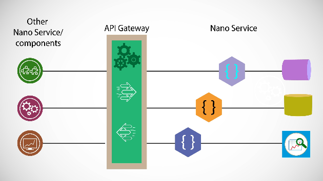

📝 NotesApp - Fullstack MERN Application
A complete web application for managing personal notes, built using the MERN stack (MongoDB, Express, React, Node.js). This app features secure user authentication, password encryption, and a private dashboard for users to manage their data.
------------------------------------------------------------------




🚀 Key Features
User Authentication: Secure Sign-up and Login functionality.

Data Security: Implementation of JSON Web Tokens (JWT) for route protection and bcryptjs for password hashing.

CRUD Operations: Users can Create, Read, Update, and Delete their own notes.

Protected Dashboard: A private area that fetches and displays data specific to the logged-in user.

Responsive UI: A modern interface built with React Hooks and Axios for seamless API communication.


-------------------------------------------------------------------


🛠️ Tech Stack
Backend
Node.js & Express: Server environment and RESTful routing.

MongoDB & Mongoose: NoSQL database and object data modeling.

JWT: Secure transmission of information between parties as a JSON object.

Bcryptjs: Industry-standard password encryption.

Frontend
React.js: Library for building the user interface.

Axios: Promise-based HTTP client for the browser and Node.js.

React Router Dom: For dynamic routing in web applications.
-------------------------------------------------------------------- 


⚙️ Installation & Setup
Follow these steps to get the project running locally:

1. Clone the repository
Bash

git clone [https://github.com/oscaradworks-ops/note-app.git]
cd notes-app-mern
2. Backend Configuration
Navigate to the root directory (where server.js is located).

Install dependencies:

Bash

npm install
Create a .env file in the root folder and add your credentials:

Code snippet

PORT=5000
MONGO_URI=your_mongodb_connection_string
JWT_SECRET=yourSecretKey
Start the server:

Bash

npm run dev
3. Frontend Configuration
Open a new terminal window.

Navigate to the frontend directory:

Bash

cd client
npm install
Start the React development server:

Bash

npm start

---------------------------------------------------------------
```text


```
🔌 API Endpoints
Method,  Endpoint,              Description,                 Auth Required
POST,    /api/auth/register,    Register a new user,             No
POST,    /api/auth/login,       Login & get access token,        No
GET,     /api/notes,            Get all notes for the user,      Yes
POST,    /api/notes,            Create a new note,               Yes
DELETE,  /api/notes/:id,        Delete a specific note,          Yes

-----------------------------------------------------------------

## 📂 Project Structure

```text
mi-app-notas/
├── config/
│   └── db.js               # Database connection logic
├── controllers/
│   ├── authController.js   # Logic for Register/Login
│   └── noteController.js   # Logic for Creating/Reading Notes
├── middleware/
│   └── auth.js             # Middleware to verify JWT tokens
├── models/
│   ├── User.js             # User Schema (Mongoose)
│   └── Note.js             # Note Schema (Mongoose)
├── routes/
│   ├── authRoutes.js       # Routes for /api/auth
│   └── noteRoutes.js       # Routes for /api/notes
├── .env                    # Environment variables (do not share this!)
├── server.js               # Main entry point for the Backend
└── README.md               # Documentation
```

📝 License
This project is open-source. Feel free to use it and modify it as you wish
